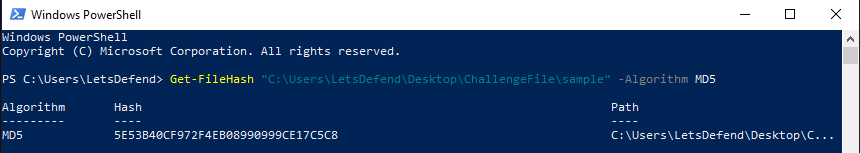
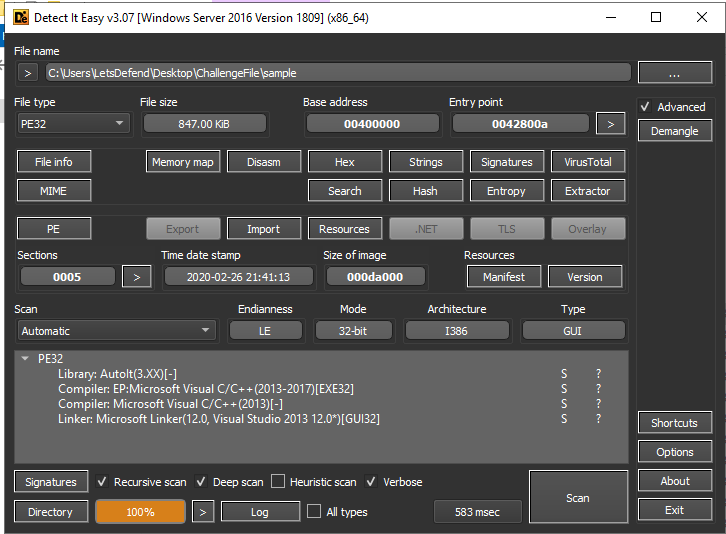
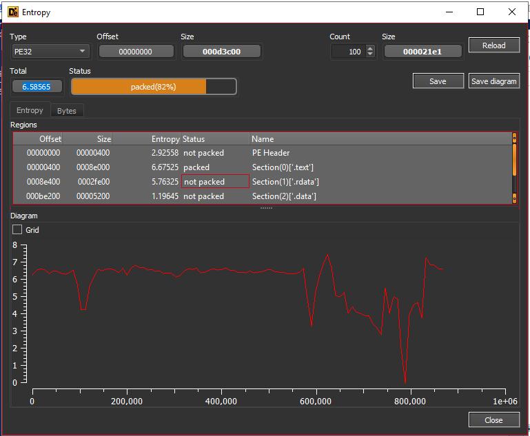
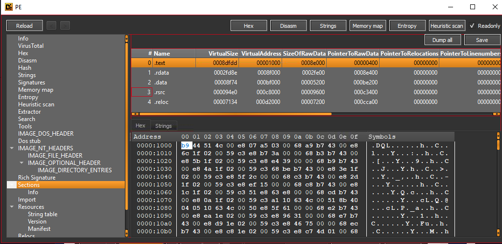
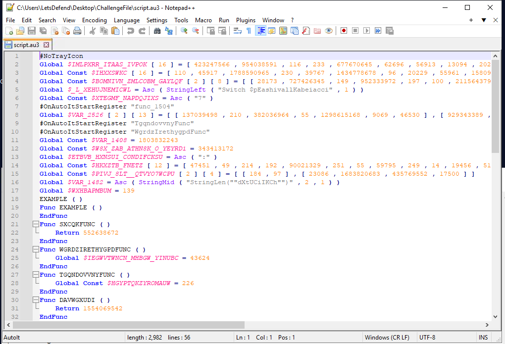
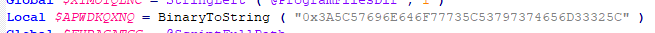
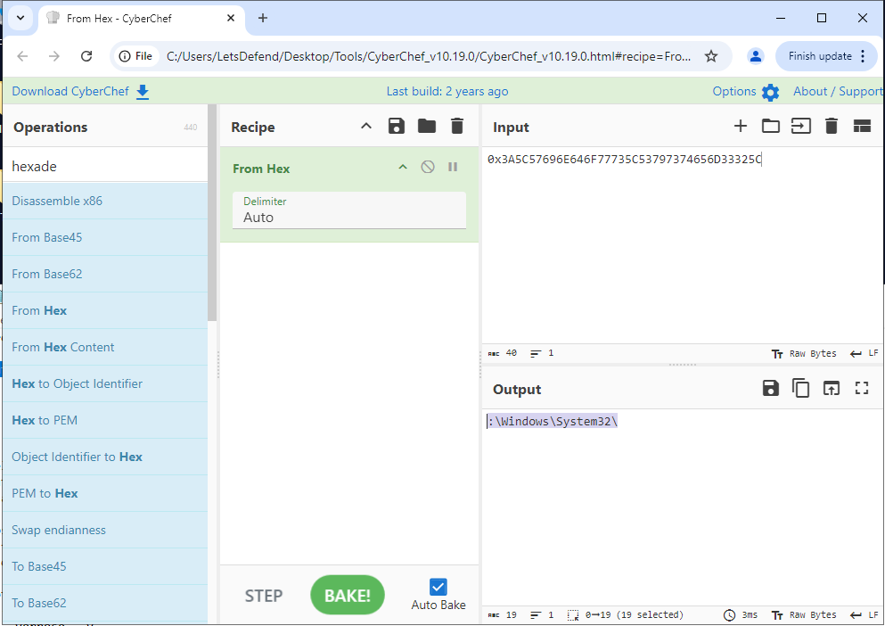
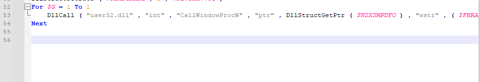

<p align="right">
  <sub>
    <b>Platform:</b> LetsDefend<br>
    <b>Difficulty:</b> Beginner<br>
    <b>Status:</b> Completed ✅<br>
    <b>URL:</b> <a href="https://app.letsdefend.io/challenge/malicious-autoit">Malicious AutoIT</a><br>
    <b>Date:</b> Apr 21, 2026<br>
    <b>Tags:</b> #letsdefend #beginner #challenge #malware #reversing #dfir
  </sub>
</p>

---

## 🧠 Overview

The SOC detected suspicious activity involving a compiled AutoIT executable. AutoIT is a legitimate scripting language frequently abused by threat actors to embed and execute malicious payloads — the compiled `.exe` format makes static analysis non-trivial without the right tooling. This challenge involved extracting, hashing, statically analysing, and decompiling the sample to recover embedded indicators.

---

## 🎯 Objectives

- Compute the MD5 hash of the sample
- Analyse PE structure and entropy using Detect It Easy (DIE)
- Extract the embedded AutoIT script using AutoIT Ripper
- Recover the C2 domain, encoded file path, and called DLL from the decompiled script

---

## 🔍 Evidence & Initial Analysis

The challenge file was provided as a password-protected archive.

**File:** `sample.zip`
**Password:** `infected`
**Location:** `C:\Users\LetsDefend\Desktop\ChallengeFile\`

After extraction, `sample` (a compiled AutoIT executable) was available for analysis.

---

## 🔬 Investigation

### Step 1 — MD5 Hash

VirusTotal was unavailable on the challenge machine. PowerShell's native `Get-FileHash` cmdlet was used as an alternative to fingerprint the sample.

```powershell
Get-FileHash "C:\Users\LetsDefend\Desktop\ChallengeFile\sample" -Algorithm MD5
```



**Finding:** MD5 hash confirmed as `5E53B40CF972F4EB08990999CE17C5C8`. This hash can be submitted to threat intel platforms for reputation checks and used as a host-based IOC.

---

### Step 2 — Entropy Analysis (DIE)

The sample was loaded into Detect It Easy (DIE). Entropy was retrieved via the Entropy button.





**Finding:** Entropy of `6.58565`. Values above ~6.5 suggest compressed or encrypted content within the binary — consistent with an embedded, obfuscated payload. This warrants deeper extraction.

---

### Step 3 — PE Section Analysis

The PE viewer within DIE was used to inspect section headers.



**Finding:** The `.text` section virtual address is `0x1000` — the standard load address for executable code in a PE binary. No anomalous section names or addresses were observed.

---

### Step 4 — Compile Timestamp & Entry Point

Both values were visible on the DIE main view without additional navigation.

| Field | Value |
|---|---|
| Time Date Stamp | `2020-02-26 21:41:13` |
| Entry Point | `0x42800a` |

**Key Evidence:** The compile timestamp of February 2020 places this sample within a known period of elevated AutoIT-based malware activity. Timestamps can be forged but provide useful triage context.

---

### Step 5 — Script Extraction via AutoIT Ripper

Compiled AutoIT executables embed the original `.au3` script. AutoIT Ripper was used to decompile and extract it.

```powershell
autoit-ripper "C:\Users\LetsDefend\Desktop\ChallengeFile\sample" "C:\Users\LetsDefend\Desktop\ChallengeFile\"
```



**Finding:** `script.au3` was successfully extracted. The decompiled source was opened in Notepad++ for manual review.

---

### Step 6 — C2 Domain

A string search within the extracted script revealed a hardcoded domain.

**IOC Found:** `office-cleaner-commander.com`

This domain name follows a pattern common to threat actors — benign-sounding names designed to blend into normal traffic. The domain should be blocked at the DNS/proxy layer and submitted to threat intel feeds.

---

### Step 7 — Hex-Encoded File Path

A hexadecimal string was identified in the script. It was decoded using CyberChef.





**Finding:** The decoded value was `C:\Windows\System32\` — indicating the malware targets the system directory, likely for DLL sideloading, payload dropping, or process injection.

---

### Step 8 — DLL Reference

A search for `.dll` within the script located a referenced library at the bottom of the file.



**Finding:** `user32.dll` is called by the malicious code. This Windows API library handles UI functions but is heavily abused for keylogging, window enumeration, and message hooking — all common in AutoIT-based RATs and stealers.

---

## 🚨 Findings

| # | Finding | Value |
|---|---|---|
| 1 | MD5 Hash | `5E53B40CF972F4EB08990999CE17C5C8` |
| 2 | File Entropy (DIE) | `6.58565` |
| 3 | `.text` Virtual Address | `0x1000` |
| 4 | Compile Timestamp | `2020-02-26 21:41:13` |
| 5 | Entry Point | `0x42800a` |
| 6 | C2 Domain | `office-cleaner-commander.com` |
| 7 | Encoded File Path (decoded) | `C:\Windows\System32\` |
| 8 | Called DLL | `user32.dll` |

---

## 🗺️ MITRE ATT&CK Mapping

| Technique | ID | Notes |
|---|---|---|
| Obfuscated Files or Information | T1027 | Embedded script with hex-encoded strings |
| Compiled HTML File / Scripting | T1059.010 | AutoIT used as scripting execution vehicle |
| System Binary Proxy Execution | T1218 | Targeting `System32`, potential DLL abuse |
| Application Layer Protocol: Web Protocols | T1071.001 | C2 communication via domain |
| Input Capture / API Hooking | T1056 | `user32.dll` abuse potential |

---

## 🧩 Key Takeaways

- **AutoIT is not inherently malicious** — but its ability to compile scripts into standalone executables makes it a popular delivery mechanism. Detection should focus on behaviour, not just the runtime.
- **Entropy is a triage accelerator** — a value of 6.58 immediately flagged embedded content before any dynamic analysis was needed.
- **Hex encoding is a low-effort obfuscation** — it evades basic string matching but is trivial to decode. Still effective against automated scanners without deobfuscation capability.
- **Decompilation was key** — without AutoIT Ripper, the C2 domain, file path, and DLL would have required dynamic analysis to surface. Static decompilation is faster and leaves no execution risk.

---

## 🛡️ Defensive Recommendations

- **Block `office-cleaner-commander.com`** at DNS and proxy layers immediately. Add to threat intel blocklists.
- **Hash-based blocking:** Add `5E53B40CF972F4EB08990999CE17C5C8` to EDR deny lists.
- **Monitor AutoIT runtime execution** — alert on `AutoIt3.exe` or compiled AutoIT executables spawning child processes or making outbound connections.
- **Restrict writes to `System32`** from non-system processes. Flag any process dropping files into this directory.
- **Audit `user32.dll` API calls** from unsigned or anomalous processes — particularly `SetWindowsHookEx` and `GetAsyncKeyState`.
- **Enable script block logging** and consider application allowlisting to prevent unauthorised compiled scripts from executing.

---

## 🛠️ Tools & References

| Tool | Purpose |
|---|---|
| PowerShell `Get-FileHash` | MD5 hash generation |
| Detect It Easy (DIE) | PE analysis — entropy, sections, timestamps, entry point |
| AutoIT Ripper | Decompiling compiled AutoIT executables to `.au3` source |
| Notepad++ | Manual script review and string searching |
| CyberChef | Hex decoding of obfuscated file path |

- [MITRE ATT&CK — T1027 Obfuscated Files](https://attack.mitre.org/techniques/T1027/)
- [AutoIT Ripper GitHub](https://github.com/nazywam/AutoIt-Ripper)
- [Detect It Easy (DIE)](https://github.com/horsicq/Detect-It-Easy)

---

<p align="center"></p>
