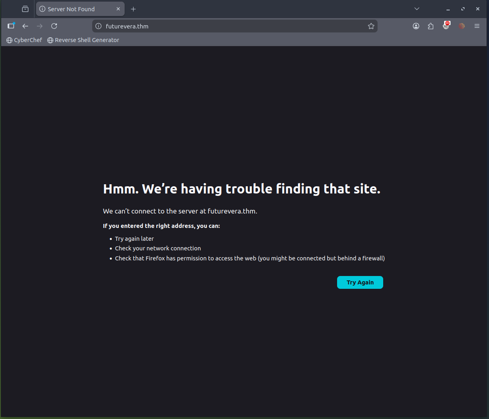

<p align="right">
  <sub>
    <b>Platform:</b> TryHackMe<br>
    <b>Difficulty:</b> Easy<br>
    <b>OS:</b> Other<br>
    <b>Status:</b> Completed ✅<br>
    <b>URL:</b> <a href="https://tryhackme.com/room/takeover">TakeOver</a><br>
    <b>Date:</b> Apr 09, 2026<br>
    <b>Tags:</b> #tryhackme #easy
  </sub>
</p>

---

## 🧠 Overview

This room is all about subdomain enumeration and SSL certificate inspection. The goal is to find a hidden subdomain that's been left exposed — and abuse it to capture the flag. No exploitation in the traditional sense; this is purely about thorough reconnaissance and knowing where to look beyond what's immediately visible.

---

## 🎯 Objectives

- Enumerate subdomains of `futurevera.thm`
- Identify hidden infrastructure through SSL certificate inspection
- Capture the flag from the exposed endpoint

---

## 🔍 Reconnaissance & Initial Analysis

Starting out, navigating directly to `https://futurevera.thm` threw an error because the domain wasn't resolving locally.



**Key Finding:** The target domain needs a manual `/etc/hosts` entry to resolve. I opened the hosts file with nano and mapped the IP.

```bash
kie@kiepc:~/THM/TakeOver$ sudo nano /etc/hosts
```

I added the following line:

```
10.129.120.244 futurevera.thm
```

With that in place, the site loaded cleanly over HTTP.


Now with a working target, I moved straight into subdomain enumeration using `ffuf`. The `-fs 4605` flag filters out responses matching the default page size, cutting out the noise from wildcard DNS responses.

```bash
kie@kiepc:~/THM/TakeOver$ ffuf -w /usr/share/wordlists/seclists/Discovery/DNS/subdomains-top1million-5000.txt -u http://futurevera.thm -H "Host: FUZZ.futurevera.thm" -fs 4605
```

**Result:** `support.futurevera.thm` came back as a valid subdomain hit.

I added it to `/etc/hosts` and tried accessing it, but hit a DNS/connection error when navigating directly. HTTP wasn't playing ball — so I shifted focus to HTTPS and SSL.

---

## ⚙️ Exploitation

**Critical Discovery:** SSL certificates often contain Subject Alternative Names (SANs) — a list of additional hostnames the cert is valid for. These are goldmines for finding infrastructure that isn't publicly advertised. I used `openssl` to inspect the certificate on the support subdomain directly.

```bash
kie@kiepc:~/THM/TakeOver$ openssl s_client -connect support.futurevera.thm:443
```

**Result:** Buried in the SAN field of the certificate was a completely undocumented subdomain:

```
secrethelpdesk934752.support.futurevera.thm
```

This is exactly the kind of thing developers leave in certs during testing and forget to clean up. I added it to my hosts file:

```
10.129.120.244 secrethelpdesk934752.support.futurevera.thm
```

Visiting the subdomain in the browser triggered a redirect to an AWS S3 bucket. The flag was embedded in the URL of that bucket.

---

## 🏁 Flags / Proof

```
flag{beea0d6edfcee06a59b83fb50ae81b2f}
```

---

## 🧩 Key Takeaways

- **Virtual host fuzzing** is essential when a target uses shared hosting or virtual hosting — standard DNS enumeration won't cut it alone.
- **SSL/TLS certificates leak information.** SAN fields regularly contain internal, staging, or forgotten subdomains that never show up in DNS brute-force wordlists.
- **S3 bucket misconfigurations** remain a serious real-world issue. An internal subdomain redirecting to an improperly secured bucket is a legitimate attack path in bug bounty and red team engagements.
- Always check HTTPS even when HTTP fails — the SSL handshake itself can give you recon data before you've even loaded a page.

---

## ⛓️ Attack Chain Summary

1. Added `futurevera.thm` to `/etc/hosts` to resolve the target locally
2. Ran `ffuf` virtual host fuzzing to discover `support.futurevera.thm`
3. Added discovered subdomain to `/etc/hosts`
4. Used `openssl s_client` to inspect the SSL certificate on port 443
5. Extracted hidden SAN entry: `secrethelpdesk934752.support.futurevera.thm`
6. Added hidden subdomain to `/etc/hosts`
7. Navigated to the subdomain — redirected to AWS S3 bucket
8. Captured flag from the bucket URL

---

## 🔎 Detection Strategies

### Offensive Indicators

- High-volume virtual host fuzzing requests with varying `Host:` headers from a single IP
- Repeated `openssl` or TLS handshake connections to subdomains without subsequent HTTP traffic
- Unusual access to S3 bucket URLs originating from unexpected geographic locations or IPs
- DNS queries for non-public subdomains that only appear in certificate SANs

### Defensive Mitigations

- **Audit SSL certificates regularly** — remove SANs for decommissioned or internal-only subdomains before issuing certs for public-facing services
- **Restrict S3 bucket access** — never leave buckets publicly accessible; enforce bucket policies and block public ACLs by default
- **Implement rate limiting and anomaly detection** on web infrastructure to flag virtual host fuzzing attempts
- **Use wildcard certificates sparingly** — explicit SAN entries for internal subdomains can inadvertently expose infrastructure topology
- **Decommission unused subdomains** and ensure they don't persist in any certificate's SAN field after going offline

---

## 🛠️ Tools & References

| Tool | Purpose |
|---|---|
| `ffuf` | Virtual host / subdomain fuzzing |
| `openssl s_client` | SSL certificate inspection and SAN extraction |
| `nano` | Editing `/etc/hosts` for local DNS resolution |
| SecLists (`subdomains-top1million-5000.txt`) | Wordlist for subdomain enumeration |

- [SecLists - Daniel Miessler](https://github.com/danielmiessler/SecLists)
- [OpenSSL s_client documentation](https://www.openssl.org/docs/man1.1.1/man1/s_client.html)
- [AWS S3 Bucket Security Best Practices](https://docs.aws.amazon.com/AmazonS3/latest/userguide/security-best-practices.html)

---


