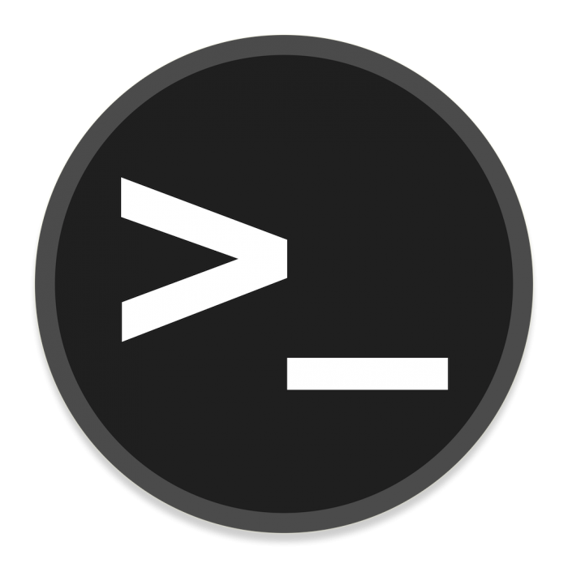

# 🔴 TryHackMe

TryHackMe rooms organised by difficulty. Focused on fundamentals, methodology, and attack flow.

---

## 📂 Difficulty

| Level | Folder |
|-------|--------|
| 🟢 Easy | [`Easy/`](./Easy/) |
| 🟡 Medium | [`Medium/`](./Medium/) |
| 🔴 Hard | [`Hard/`](./Hard/) |

---

## 🖥️ Machines

| Icon | Room | Difficulty | Tags | Date |
|------|------|------------|------|------|
|  | [CupidBot](Easy/CupidBot/CupidBot.md) | `Easy` | `#machine` `#prompt-injection` `#ai-security` `#web` | Mar 02, 2026 |
|  | [RootMe](Easy/RootMe/RootMe.md) | `Easy` | `#machine` `#file-upload` `#rce` `#privilege-escalation` | Mar 02, 2026 |

---

> Writeups authored in Notion, auto-published via CTF Publisher.
